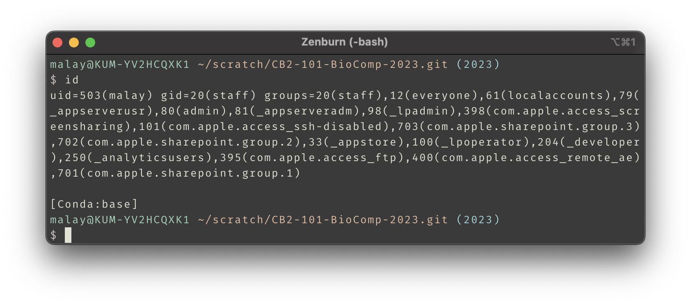
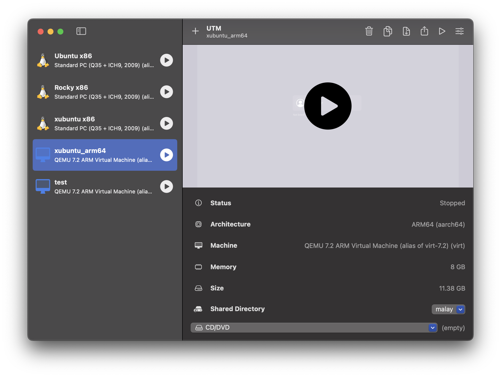
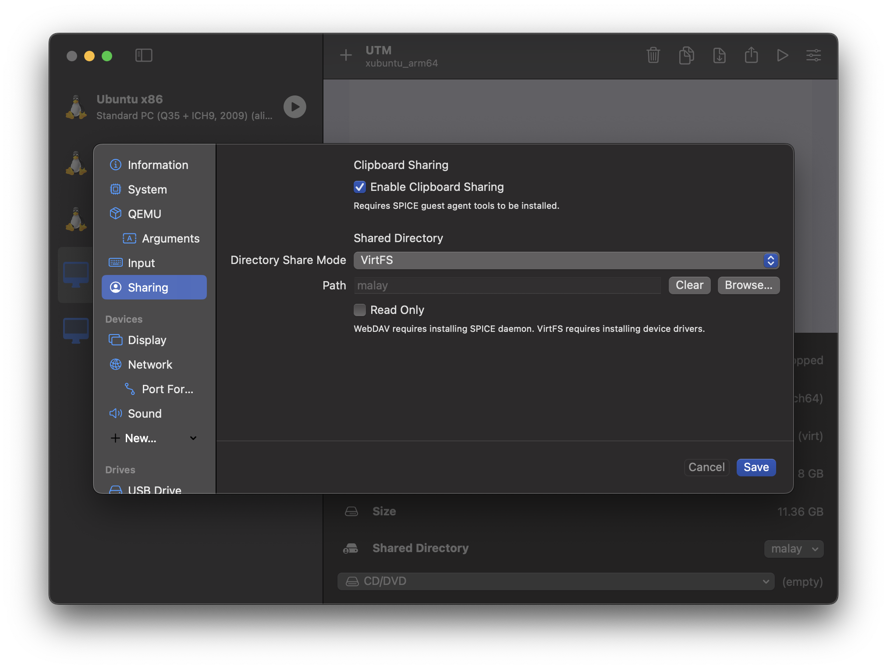
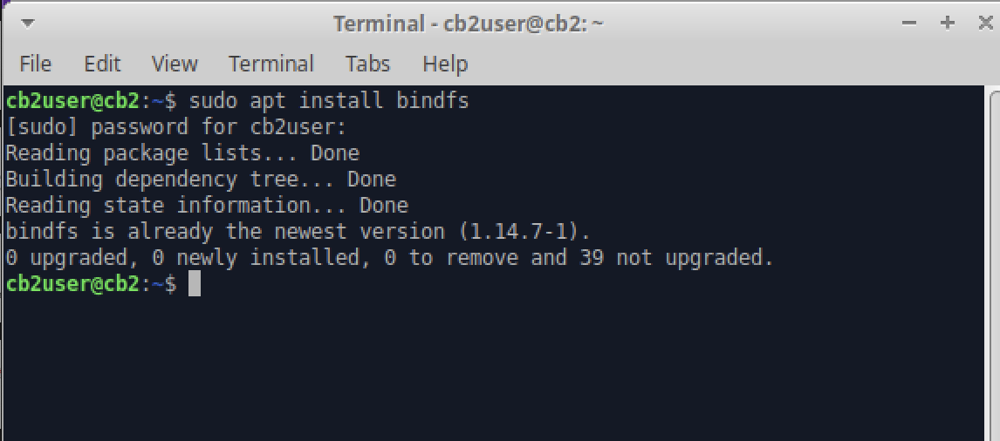

```{r setup, include=FALSE}
knitr::opts_chunk$set(echo = TRUE)
```

## How to access shared folder

First in you mac host check your `UID` and `GID`.


Looks like my `UID` is 503 and `GID` is 20. Remember that.

Then check the correct options are selection in virtual machine settings.



I have shared my home directory `malay`.


Make sure you have `virtFS` selected as sharing mode.

Now boot the VM and make sure that you have the `bindfs` installed.


Create a directory where your shared files will be mounted by the `root`. I will create this directory in `/mnt`. And call it `macos`.

```bash
sudo mkdir -p /mnt/macos
```

We will also create another directory called `mac` in your home where this directory will be mounted using a system called bind mount. *Note* there is no `sudo` in it.

```bash
cd
mkdir mac
```

Now add the following lines in your `/etc/fstab`. You can copy and paste your these lines.

```bash
share  /mnt/macos 9p trans=virtio,version=9p2000.L,rw,_netdev,nofail	0	0
/mnt/macos /home/cb2user/mac fuse.bindfs map=503/1000:@20/@1000,x-systemd.requires=/mnt/macos 0 0
```

Note that in the second line `503` is the UID and `20` is the GID of my mac, as we found out in the first step. You need to use `sudo /etc/fstab` to edit the file.

Now reboot. All your mac files will be in `~/mac` directory.

---
